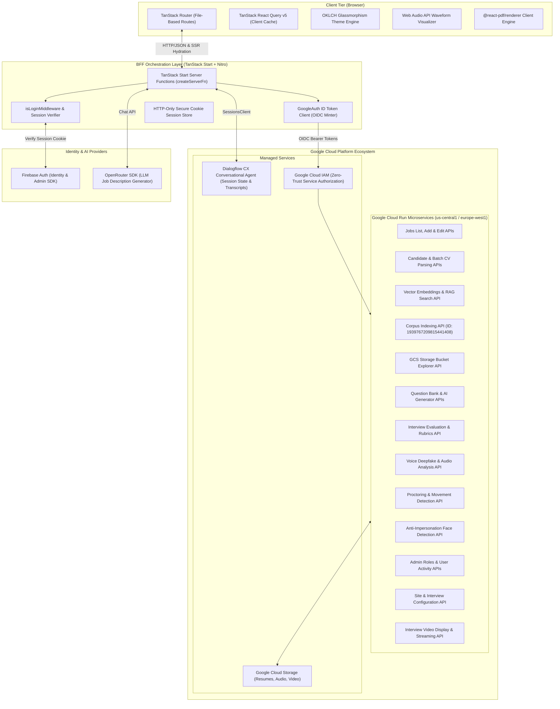

# EazyAI System Architecture

This document provides a comprehensive deep dive into the technical architecture, design patterns, security model, and infrastructure of the **EazyAI** automated hiring and talent intelligence platform.

---

## 1. High-Level Architecture Overview

EazyAI is engineered as a modern, high-performance full-stack web application employing a **Backend-For-Frontend (BFF)** pattern powered by **TanStack Start** and **Nitro**. It acts as the secure orchestrator between client interfaces and a distributed suite of 20+ microservices deployed across Google Cloud Platform (Cloud Run, Dialogflow CX, Google Cloud Storage), Firebase Authentication, and external LLM providers (OpenRouter).



---

## 2. Core Architectural Principles

### 2.1 Backend-For-Frontend (BFF) Pattern

Rather than letting the browser communicate directly with distributed Cloud Run endpoints—which would expose microservice URLs, complicate CORS, and require public endpoint exposure—EazyAI employs the **BFF pattern**:

- All client communications pass through TanStack Start **server functions** (`createServerFn`).
- Sensitive operations, API keys, service account credentials, and service-to-service IAM tokens remain strictly server-side.
- Microservices remain private and protected behind Google Cloud IAM.

### 2.2 Zero-Trust Security & Identity Propagation

- **Client to BFF**: The browser maintains no long-lived passwords or sensitive tokens. Authentication is backed by Firebase Auth, but once signed in, an ID token is exchanged for an HTTP-only, secure, `SameSite=Lax` session cookie managed by Firebase Admin SDK.
- **BFF to Microservices**: The BFF leverages Google Application Default Credentials (ADC) via `google-auth-library` to mint OpenID Connect (OIDC) ID tokens scoped to the exact destination Cloud Run service URL.
- **Role-Based Access Control (RBAC)**: Route-level guards (`beforeLoad`) verify decoded session claims and query user permissions via `userRoleQueryOptions` before delivering dashboard views.

### 2.3 Universal Data Fetching & Caching

- Server functions are paired with **TanStack React Query v5** `queryOptions`.
- Route loaders prefetch critical data on the server during SSR (`ensureQueryData` / `prefetchQuery`), avoiding client layout shifts.
- Client queries leverage a global `staleTime: 60_000` (1 minute) for instantaneous back/forward navigation.

---

## 3. Layer-by-Layer Architectural Breakdown

### 3.1 Client Tier

- **Routing**: TanStack Router v1 utilizing file-based routing (`src/routes/`). Layouts are nested under `src/routes/dashboard/route.tsx` and `src/routes/_auth/route.tsx`.
- **UI & Design System**: Tailwind CSS v4 configured with OKLCH dynamic color palettes and frosted glassmorphism utilities (`glass-card`, `glass-header`, `glass-sidebar`).
- **Interactive Multimedia**:
  - **Audio**: Web Audio API waveform analyzer with frequency and time-domain visualization, dynamic playback speed (0.75x–2.0x), and scrub controls.
  - **Video**: Video streaming and preview component with custom HTML5 controls and responsive container aspect-ratios.
  - **Dossier Reports**: Client-side PDF rendering using `@react-pdf/renderer` for instantaneous export of multi-page candidate evaluation summaries.

### 3.2 Server Tier (TanStack Start & Nitro Engine)

The application server runs on **Nitro**, compiled to an ESM bundle (`.output/server/index.mjs`).

- **Middleware**: `isLoginMiddleware` intercepts server functions, reads the `session` cookie, verifies it with Firebase Admin SDK, and injects `userInfo` into the function context.
- **Error Boundaries**: Server functions encapsulate network failures, downstream HTTP status errors, and parse failures, surfacing normalized error states to the client.

### 3.3 Microservices Tier (Google Cloud Run)

Downstream services handle discrete computational domains:

1. **Resume Processing & RAG**: Handles file ingestion into GCS buckets, extraction of candidate profiles, vector embedding generation, and cosine similarity matching against requisition criteria.
2. **Interview Engine**: Manages scheduled interviews, collects question responses, analyzes voice recordings for synthetic/deepfake artifacts, and correlates proctoring events (gaze deviations, tab changes).
3. **Conversational AI**: Dialogflow CX integration enables automated spoken technical interviews, parsing candidate responses through speech-to-text pipelines.

---

## 4. Authentication & Session Lifecycle

EazyAI implements a defense-in-depth, zero-trust authentication architecture separating client session state from downstream cloud service authorization. It pairs **Firebase Web SDK** on the client with **Firebase Admin SDK** on the TanStack Start BFF, securing session state via cryptographically signed, HTTP-only session cookies and isolating private Google Cloud Run microservices behind **Google Cloud IAM OIDC bearer tokens**.

### 4.1 Dual-Tier Identity Architecture

```
┌──────────────────────────────────────────────────────────────────────────────────┐
│                              CLIENT TIER (Browser)                               │
│  • Firebase Web SDK (firebase/auth) handles credential exchange                  │
│  • Obtains ephemeral Firebase ID Token (~1 hour lifespan)                       │
│  • Dispatches ID token to BFF via loginFn (NEVER stored in localStorage)         │
└────────────────────────────────────────┬─────────────────────────────────────────┘
                                         │ POST /_serverFn/loginFn
                                         ▼
┌──────────────────────────────────────────────────────────────────────────────────┐
│                         BFF TIER (TanStack Start Server)                         │
│  • Firebase Admin SDK creates cryptographically signed session cookie (5 days)   │
│  • Injects Set-Cookie: session=...; HttpOnly; Secure; SameSite=Lax; Path=/       │
│  • isLoginMiddleware extracts & validates cookie (checkRevoked: true)            │
│  • Injects decoded claims (UID, email) into server function context.userInfo     │
└────────────────────────────────────────┬─────────────────────────────────────────┘
                                         │ GoogleAuth().getIdTokenClient(serviceUrl)
                                         ▼
┌──────────────────────────────────────────────────────────────────────────────────┐
│                  MICROSERVICES TIER (Google Cloud Run / IAM)                     │
│  • BFF mints audience-scoped Google Cloud IAM OIDC Bearer Token via ADC          │
│  • Google Cloud IAM verifies token signature, audience, and roles/run.invoker    │
│  • Private Cloud Run services execute request without exposure to the internet    │
└──────────────────────────────────────────────────────────────────────────────────┘
```

---

### 4.2 End-to-End Authentication & Session Lifecycle Sequence

The sequence below illustrates the complete lifecycle across all operational phases: **Session Creation & Role Resolution**, **Route-Level Guarding**, **Authenticated Mutation & IAM Delegation**, and **Session Termination**:

```mermaid
sequenceDiagram
    autonumber
    actor User as "Recruiter / Admin"
    participant Client as "Browser (React / Router)"
    participant BFF as "TanStack Start BFF"
    participant AdminAuth as "Firebase Admin SDK"
    participant CloudRun as "Cloud Run (IAM Protected)"

    %% -----------------------------------------------------------
    %% PHASE 1: LOGIN & SESSION CREATION
    %% -----------------------------------------------------------
    rect rgb(15, 23, 42)
        Note over User,CloudRun: Phase 1: Authentication and Session Creation
        User->>Client: Enters credentials or clicks Google SSO
        Client->>Client: Firebase Client SDK signs in and acquires short-lived ID Token
        Client->>BFF: loginFn({ data: idToken })
        BFF->>AdminAuth: createSessionCookie(idToken, 5-day expiry)
        AdminAuth-->>BFF: Signed session cookie
        BFF-->>Client: Set-Cookie: session (HttpOnly, Secure, SameSite=Lax, Path=/)
        Client->>BFF: getUserRole({ data: { user_id: uid } })
        BFF-->>Client: Role verification (Super Admin, Recruiter, Evaluator)
        Note over Client: If role is unassigned, client triggers signOut and halts
    end

    %% -----------------------------------------------------------
    %% PHASE 2: ROUTE GUARDS & SSR DATA PREFETCH
    %% -----------------------------------------------------------
    rect rgb(30, 41, 59)
        Note over User,CloudRun: Phase 2: Route Protection and SSR Loader Guard (/dashboard)
        User->>Client: Navigates to /dashboard/*
        Client->>BFF: Router beforeLoad hook triggers getUserFn()
        BFF->>BFF: Reads getCookie('session')
        alt No session cookie present
            BFF-->>Client: Redirect to /login
        else Session cookie exists
            BFF->>AdminAuth: verifySessionCookie(session, checkRevoked=true)
            alt Token revoked or expired
                AdminAuth-->>BFF: Verification Error
                BFF-->>Client: Redirect to /login
            else Token valid
                AdminAuth-->>BFF: Decoded claims (UID, email)
                BFF->>Client: Return user context and prefetch role options
            end
        end
    end

    %% -----------------------------------------------------------
    %% PHASE 3: AUTHENTICATED REQUEST & M2M IAM DELEGATION
    %% -----------------------------------------------------------
    rect rgb(15, 23, 42)
        Note over User,CloudRun: Phase 3: Authenticated Server Function and M2M IAM Delegation
        Client->>BFF: Server function invocation (e.g. getJobsList)
        BFF->>BFF: isLoginMiddleware intercepts and calls getUserFn()
        BFF->>AdminAuth: verifySessionCookie(session, checkRevoked=true)
        AdminAuth-->>BFF: Claims verified -> context.userInfo attached
        BFF->>BFF: GoogleAuth().getIdTokenClient(serviceBaseUrl)
        Note over BFF: Mints GCP OIDC Token scoped to target service URL
        BFF->>CloudRun: POST /api/v1/... [Authorization: Bearer GCP_OIDC_TOKEN]
        CloudRun->>CloudRun: Cloud IAM verifies OIDC token and roles/run.invoker
        CloudRun-->>BFF: 200 OK + JSON domain payload
        BFF-->>Client: Typed domain response
    end

    %% -----------------------------------------------------------
    %% PHASE 4: SESSION INVALIDATION & LOGOUT
    %% -----------------------------------------------------------
    rect rgb(30, 41, 59)
        Note over User,CloudRun: Phase 4: Session Invalidation and Logout
        User->>Client: Clicks Logout button
        Client->>BFF: logoutFn()
        BFF->>BFF: deleteCookie('session', { path: '/' })
        BFF-->>Client: Set-Cookie: session (Max-Age=0, Path=/)
        Client->>Client: firebase.auth().signOut()
        Client->>Client: queryClient.clear() (Purges cached permissions and data)
        Client-->>User: Redirect to /_auth/login
    end
```



---

### 4.3 Session Cookie Policy & Security Hardening

Session cookies are issued exclusively through [`src/lib/auth.ts`](file:///Users/souvikbanerjee/codes/tanstack-learn-work/src/lib/auth.ts) and follow strict defense-in-depth criteria:

| Parameter | Configuration | Security Objective |
| :--- | :--- | :--- |
| **Name** | `session` | Standard session cookie identifier. |
| **Lifespan (`maxAge`)** | `432,000,000 ms` (5 Days) | Synchronized with Firebase Admin's `createSessionCookie` maximum validity. |
| **`httpOnly`** | `true` | Prevents document object model (`document.cookie`) access; mitigates XSS session token theft. |
| **`secure`** | `process.env.NODE_ENV === 'production'` | Enforces TLS/HTTPS-only transmission in production environments; permits local development. |
| **`sameSite`** | `'lax'` | Defends against Cross-Site Request Forgery (CSRF) while permitting safe top-level navigations. |
| **`path`** | `'/'` | Ensures cookie is attached to all sub-paths and server function RPC routes. |

---

### 4.4 Server-Side Middleware (`isLoginMiddleware`)

Located at [`src/lib/middleware.ts`](file:///Users/souvikbanerjee/codes/tanstack-learn-work/src/lib/middleware.ts), `isLoginMiddleware` standardizes security enforcement across all 30+ mutating and query server functions:

```typescript
export const isLoginMiddleware = createMiddleware({ type: 'function' }).server(
  async ({ next }) => {
    const user = await getUserFn()
    return next({
      context: {
        userInfo: user,
      },
    })
  },
)
```

1. **Extraction**: `getUserFn` inspects incoming HTTP request headers via `getCookie('session')`.
2. **Revocation Check**: Calls `adminAuth.verifySessionCookie(session, true)`. The `checkRevoked: true` flag performs a real-time check against Firebase to ensure the session has not been revoked or the user disabled.
3. **Context Injection**: On success, decoded claims (`uid`, `email`, custom claims) are attached to `context.userInfo`.
4. **Boundary Redirect**: If the cookie is absent or invalid, `getUserFn` throws a TanStack Router `redirect({ to: '/login' })`, interrupting server execution before any downstream business logic or microservice RPC occurs.

---

### 4.5 Route Guarding Architecture (`beforeLoad`)

EazyAI enforces route authentication boundaries at the routing level before rendering layouts or components:

1. **Protected Dashboard Hierarchy (`/dashboard/*`)**:
   - Defined in [`src/routes/dashboard/route.tsx`](file:///Users/souvikbanerjee/codes/tanstack-learn-work/src/routes/dashboard/route.tsx).
   - Executes a server-side `beforeLoad` hook that awaits `getUserFn()` and prefetches the user's RBAC role through `context.queryClient.ensureQueryData(userRoleQueryOptions)`.
   - Prevents unauthenticated users from receiving SSR-rendered dashboard markup, leaking sensitive hiring data, or rendering client layout shells.
2. **Guest Auth Hierarchy (`/_auth/*`)**:
   - Defined in [`src/routes/_auth/route.tsx`](file:///Users/souvikbanerjee/codes/tanstack-learn-work/src/routes/_auth/route.tsx).
   - Executes a `beforeLoad` hook leveraging `isLoggedIn()` (a non-throwing variant of `getUserFn`).
   - Automatically redirects authenticated users to `/dashboard`, preventing logged-in recruiters from re-accessing login or registration forms.
3. **Pending Role Assignment Gate**:
   - Upon successful credential authentication in [`login-form.tsx`](file:///Users/souvikbanerjee/codes/tanstack-learn-work/src/components/web/login-form.tsx), the client queries `getUserRole`.
   - If the account has not yet been assigned a role by an administrator (`role === null`), the client immediately calls `signOut(auth)` and displays a notification: *"Your account is created. You will be notified by admin when role will be assigned"*.

---

### 4.6 Machine-to-Machine (M2M) IAM Delegation to Cloud Run

A core security principle of EazyAI is that **user session cookies never propagate to backend microservices**:

- **No User Credentials Downstream**: Downstream Cloud Run services are configured with `ingress: internal-and-cloud-load-balancing` or private IAM authorization (`allUsers` invocation is strictly disabled).
- **Google Cloud IAM Authentication**: When a server function must communicate with a microservice, the BFF utilizes Google's `google-auth-library`:
  ```typescript
  const auth = new GoogleAuth()
  const client = await auth.getIdTokenClient(serviceBaseUrl)
  const response = await client.request({ url, method, data, headers })
  ```
- **Audience-Bound OIDC Tokens**: The `getIdTokenClient` automatically mints an OpenID Connect (OIDC) identity token whose audience (`aud`) strictly matches the target service's base URL.
- **Fail-Safe Sanitization**: If a downstream service rejects a request (401, 403, 500), the BFF catches the error and returns a sanitized domain error payload, preventing cloud infrastructure traces, project IDs, or internal URLs from leaking to the browser client.

---

### 4.7 Session Termination & Revocation Lifecycle

Session termination cleanly tears down state across all application layers:

1. **BFF Invalidation**: The client calls `logoutFn()`, which executes `deleteCookie('session', { path: '/' })`, setting `Max-Age: 0` on the session cookie.
2. **Client Identity Reset**: The client executes Firebase Web SDK `signOut(auth)` to clear client-side auth tokens.
3. **Cache Purge**: `queryClient.clear()` wipes all cached queries, role permissions, candidate data, and job records from browser memory.
4. **Immediate Admin Revocation**: When an administrator disables a user or revokes permissions via the Admin Console, Firebase marks the user's refresh tokens as revoked. Because `isLoginMiddleware` enforces `checkRevoked: true` on every server function call, revoked sessions are barred instantly without waiting for the 5-day cookie lifespan to expire.

---

## 5. Caching & Data Synchronization Architecture

To balance real-time freshness and network efficiency, EazyAI implements a multi-tier caching strategy:

| Data Type              | Server Cache (SSR)              | Client Cache (React Query)      | Invalidation Trigger              |
| :--------------------- | :------------------------------ | :------------------------------ | :-------------------------------- |
| **Job Listings**       | Prefetched in route `loader`    | `staleTime: 60s`, `gcTime: 5m`  | Job creation, edit, status toggle |
| **Candidate Records**  | Server-loaded per page/cursor   | `staleTime: 30s`                | Batch CV upload, single addition  |
| **RAG Profile Search** | On-demand execute               | Cached per search parameters    | Search filter mutation            |
| **Interview Outcomes** | Server-loaded by Requisition ID | `staleTime: 15s`                | Manual evaluation submitted       |
| **User Role & Claims** | Cached in route context         | Cached indefinitely per session | Role modification in Admin UI     |

---

## 6. Directory Structure & Code Organization

```
tanstack-learn-work/
├── .agents/skills/            # Agentic workflows & domain skill references
├── docs/                      # Technical architecture, API & developer documentation
├── prisma/                    # Relational data schema & seeds (PostgreSQL)
├── public/                    # Static assets & public icons
├── src/
│   ├── assets/                # Application logos & vector artwork
│   ├── components/
│   │   ├── ui/                # Base primitives (shadcn/ui, Radix UI)
│   │   └── web/               # Domain components (Audio player, Video, RAG cards, Modals)
│   ├── hooks/                 # Reusable React hooks (mobile detect, theme)
│   ├── lib/
│   │   ├── api-path.ts        # Centralized microservice endpoint registry
│   │   ├── auth.ts            # Server-side authentication helpers & cookie handlers
│   │   ├── db.ts              # Database client wrapper
│   │   ├── dialogflow-server.ts # Dialogflow CX session client & voice pipeline
│   │   ├── export-utils.ts    # CSV, JSON & markdown export utilities
│   │   ├── firebase.ts        # Client Firebase configuration
│   │   ├── firebase-server.ts # Firebase Admin SDK initialization
│   │   ├── middleware.ts      # Route & server function middlewares
│   │   ├── server-function.ts # Comprehensive BFF server functions
│   │   ├── theme-provider.tsx # Dark/light theme context & CSS variable injector
│   │   ├── types.ts           # Unified domain TypeScript interfaces
│   │   └── utils.ts           # Class merging (cn) and formatting utilities
│   ├── routes/                # TanStack Router file-based route definitions
│   │   ├── __root.tsx         # Root layout with QueryClientProvider & Toaster
│   │   ├── _auth/             # Authentication sub-tree (login, signup)
│   │   ├── dashboard/         # Protected dashboard modules
│   │   └── index.tsx          # Landing / overview experience
│   ├── schemas/               # Zod validation schemas for forms & payloads
│   ├── routeTree.gen.ts       # Automatically generated route manifest
│   ├── router.tsx             # Router instantiation & configuration
│   └── styles.css             # Tailwind CSS v4 tokens, glassmorphism & keyframes
├── apphosting.yaml            # Firebase App Hosting deployment configuration
├── Dockerfile                 # Multi-stage production container build
├── package.json               # Dependencies, scripts & build manifest
└── vite.config.ts             # Vite build pipeline with Nitro & TanStack Start
```
