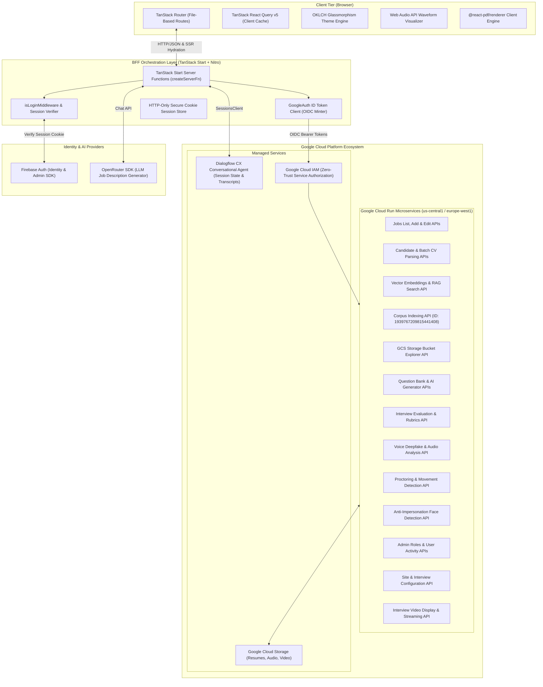

# EazyAI System Architecture

This document provides a comprehensive deep dive into the technical architecture, design patterns, security model, and infrastructure of the **EazyAI** automated hiring and talent intelligence platform.

---

## 1. High-Level Architecture Overview

EazyAI is engineered as a modern, high-performance full-stack web application employing a **Backend-For-Frontend (BFF)** pattern powered by **TanStack Start** and **Nitro**. It acts as the secure orchestrator between client interfaces and a distributed suite of 20+ microservices deployed across Google Cloud Platform (Cloud Run, Dialogflow CX, Google Cloud Storage), Firebase Authentication, and external LLM providers (OpenRouter).



---

## 2. Core Architectural Principles

### 2.1 Backend-For-Frontend (BFF) Pattern

Rather than letting the browser communicate directly with distributed Cloud Run endpoints—which would expose microservice URLs, complicate CORS, and require public endpoint exposure—EazyAI employs the **BFF pattern**:

- All client communications pass through TanStack Start **server functions** (`createServerFn`).
- Sensitive operations, API keys, service account credentials, and service-to-service IAM tokens remain strictly server-side.
- Microservices remain private and protected behind Google Cloud IAM.

### 2.2 Zero-Trust Security & Identity Propagation

- **Client to BFF**: The browser maintains no long-lived passwords or sensitive tokens. Authentication is backed by Firebase Auth, but once signed in, an ID token is exchanged for an HTTP-only, secure, `SameSite=Lax` session cookie managed by Firebase Admin SDK.
- **BFF to Microservices**: The BFF leverages Google Application Default Credentials (ADC) via `google-auth-library` to mint OpenID Connect (OIDC) ID tokens scoped to the exact destination Cloud Run service URL.
- **Role-Based Access Control (RBAC)**: Route-level guards (`beforeLoad`) verify decoded session claims and query user permissions via `userRoleQueryOptions` before delivering dashboard views.

### 2.3 Universal Data Fetching & Caching

- Server functions are paired with **TanStack React Query v5** `queryOptions`.
- Route loaders prefetch critical data on the server during SSR (`ensureQueryData` / `prefetchQuery`), avoiding client layout shifts.
- Client queries leverage a global `staleTime: 60_000` (1 minute) for instantaneous back/forward navigation.

---

## 3. Layer-by-Layer Architectural Breakdown

### 3.1 Client Tier

- **Routing**: TanStack Router v1 utilizing file-based routing (`src/routes/`). Layouts are nested under `src/routes/dashboard/route.tsx` and `src/routes/_auth/route.tsx`.
- **UI & Design System**: Tailwind CSS v4 configured with OKLCH dynamic color palettes and frosted glassmorphism utilities (`glass-card`, `glass-header`, `glass-sidebar`).
- **Interactive Multimedia**:
  - **Audio**: Web Audio API waveform analyzer with frequency and time-domain visualization, dynamic playback speed (0.75x–2.0x), and scrub controls.
  - **Video**: Video streaming and preview component with custom HTML5 controls and responsive container aspect-ratios.
  - **Dossier Reports**: Client-side PDF rendering using `@react-pdf/renderer` for instantaneous export of multi-page candidate evaluation summaries.

### 3.2 Server Tier (TanStack Start & Nitro Engine)

The application server runs on **Nitro**, compiled to an ESM bundle (`.output/server/index.mjs`).

- **Middleware**: `isLoginMiddleware` intercepts server functions, reads the `session` cookie, verifies it with Firebase Admin SDK, and injects `userInfo` into the function context.
- **Error Boundaries**: Server functions encapsulate network failures, downstream HTTP status errors, and parse failures, surfacing normalized error states to the client.

### 3.3 Microservices Tier (Google Cloud Run)

Downstream services handle discrete computational domains:

1. **Resume Processing & RAG**: Handles file ingestion into GCS buckets, extraction of candidate profiles, vector embedding generation, and cosine similarity matching against requisition criteria.
2. **Interview Engine**: Manages scheduled interviews, collects question responses, analyzes voice recordings for synthetic/deepfake artifacts, and correlates proctoring events (gaze deviations, tab changes).
3. **Conversational AI**: Dialogflow CX integration enables automated spoken technical interviews, parsing candidate responses through speech-to-text pipelines.

---

## 4. Authentication & Session Lifecycle

```mermaid
sequenceDiagram
    autonumber
    actor User as Recruiter / Admin
    participant Client as Browser (React)
    participant BFF as TanStack Start BFF
    participant AdminAuth as Firebase Admin SDK
    participant CloudRun as Cloud Run Services

    User->>Client: Enters credentials & submits login
    Client->>Client: Firebase Client SDK signs in & gets ID token
    Client->>BFF: loginFn(idToken)
    BFF->>AdminAuth: createSessionCookie(idToken, { expiresIn: 5 days })
    AdminAuth-->>BFF: Signed session cookie
    BFF-->>Client: Set-Cookie: session=...; HttpOnly; Secure; SameSite=Lax

    Note over Client,BFF: Authenticated Request Flow
    Client->>BFF: Server function call (e.g., getJobDetails)
    BFF->>BFF: isLoginMiddleware intercepts
    BFF->>AdminAuth: verifySessionCookie(session, checkRevoked: true)
    AdminAuth-->>BFF: Decoded claims (UID, email)
    BFF->>BFF: GoogleAuth().getIdTokenClient(serviceUrl)
    BFF->>CloudRun: GET /api/jobs-list-api [Authorization: Bearer ID_TOKEN]
    CloudRun-->>BFF: JSON Response
    BFF-->>Client: Typed domain data
```

---

## 5. Caching & Data Synchronization Architecture

To balance real-time freshness and network efficiency, EazyAI implements a multi-tier caching strategy:

| Data Type              | Server Cache (SSR)              | Client Cache (React Query)      | Invalidation Trigger              |
| :--------------------- | :------------------------------ | :------------------------------ | :-------------------------------- |
| **Job Listings**       | Prefetched in route `loader`    | `staleTime: 60s`, `gcTime: 5m`  | Job creation, edit, status toggle |
| **Candidate Records**  | Server-loaded per page/cursor   | `staleTime: 30s`                | Batch CV upload, single addition  |
| **RAG Profile Search** | On-demand execute               | Cached per search parameters    | Search filter mutation            |
| **Interview Outcomes** | Server-loaded by Requisition ID | `staleTime: 15s`                | Manual evaluation submitted       |
| **User Role & Claims** | Cached in route context         | Cached indefinitely per session | Role modification in Admin UI     |

---

## 6. Directory Structure & Code Organization

```
tanstack-learn-work/
├── .agents/skills/            # Agentic workflows & domain skill references
├── docs/                      # Technical architecture, API & developer documentation
├── prisma/                    # Relational data schema & seeds (PostgreSQL)
├── public/                    # Static assets & public icons
├── src/
│   ├── assets/                # Application logos & vector artwork
│   ├── components/
│   │   ├── ui/                # Base primitives (shadcn/ui, Radix UI)
│   │   └── web/               # Domain components (Audio player, Video, RAG cards, Modals)
│   ├── hooks/                 # Reusable React hooks (mobile detect, theme)
│   ├── lib/
│   │   ├── api-path.ts        # Centralized microservice endpoint registry
│   │   ├── auth.ts            # Server-side authentication helpers & cookie handlers
│   │   ├── db.ts              # Database client wrapper
│   │   ├── dialogflow-server.ts # Dialogflow CX session client & voice pipeline
│   │   ├── export-utils.ts    # CSV, JSON & markdown export utilities
│   │   ├── firebase.ts        # Client Firebase configuration
│   │   ├── firebase-server.ts # Firebase Admin SDK initialization
│   │   ├── middleware.ts      # Route & server function middlewares
│   │   ├── server-function.ts # Comprehensive BFF server functions
│   │   ├── theme-provider.tsx # Dark/light theme context & CSS variable injector
│   │   ├── types.ts           # Unified domain TypeScript interfaces
│   │   └── utils.ts           # Class merging (cn) and formatting utilities
│   ├── routes/                # TanStack Router file-based route definitions
│   │   ├── __root.tsx         # Root layout with QueryClientProvider & Toaster
│   │   ├── _auth/             # Authentication sub-tree (login, signup)
│   │   ├── dashboard/         # Protected dashboard modules
│   │   └── index.tsx          # Landing / overview experience
│   ├── schemas/               # Zod validation schemas for forms & payloads
│   ├── routeTree.gen.ts       # Automatically generated route manifest
│   ├── router.tsx             # Router instantiation & configuration
│   └── styles.css             # Tailwind CSS v4 tokens, glassmorphism & keyframes
├── apphosting.yaml            # Firebase App Hosting deployment configuration
├── Dockerfile                 # Multi-stage production container build
├── package.json               # Dependencies, scripts & build manifest
└── vite.config.ts             # Vite build pipeline with Nitro & TanStack Start
```
